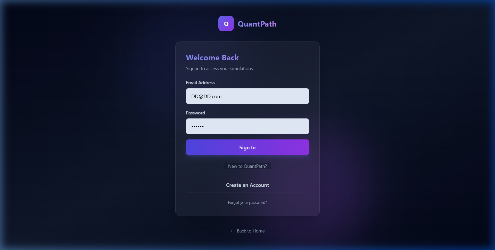
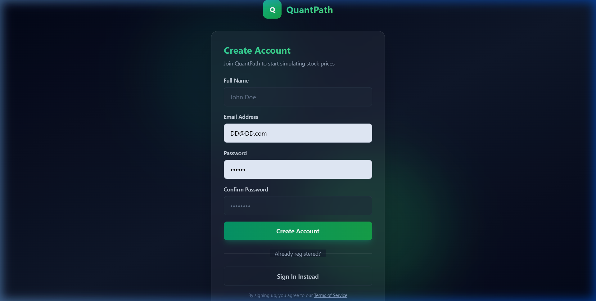
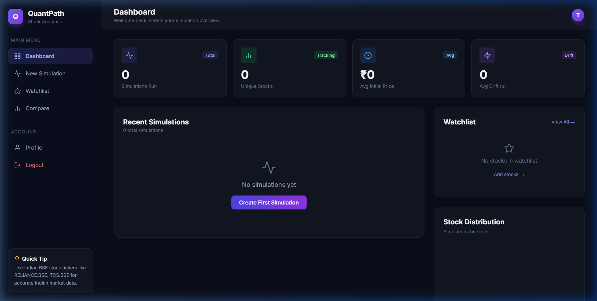
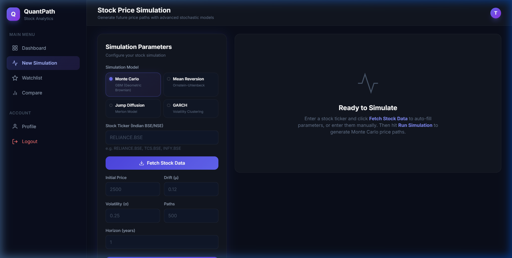
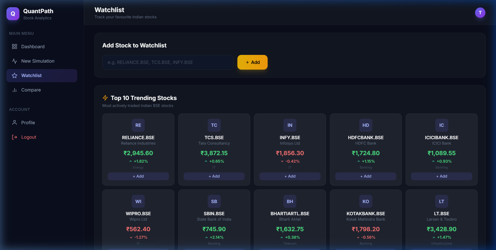
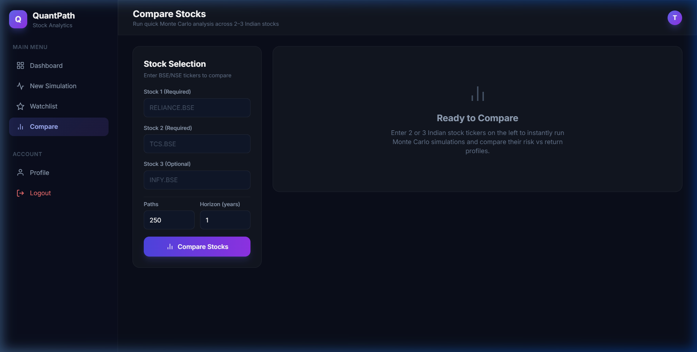
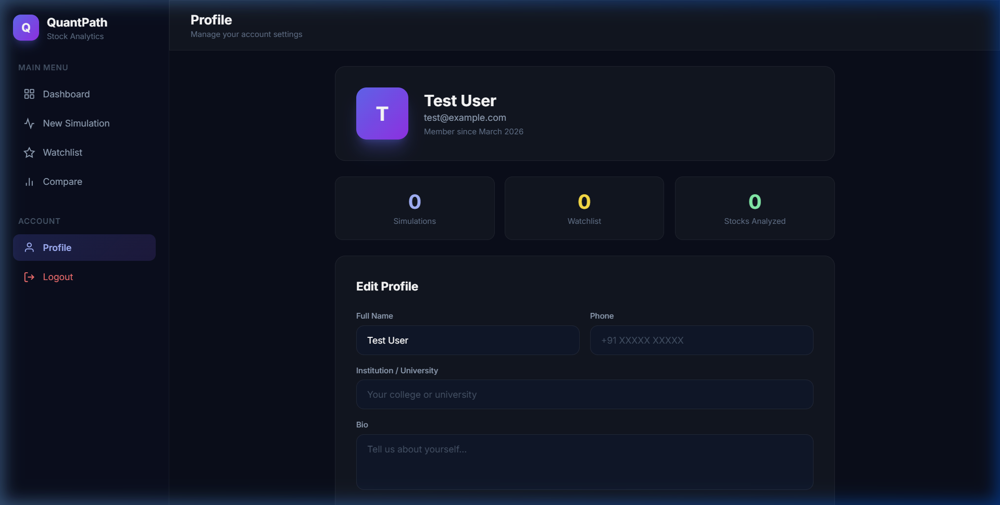
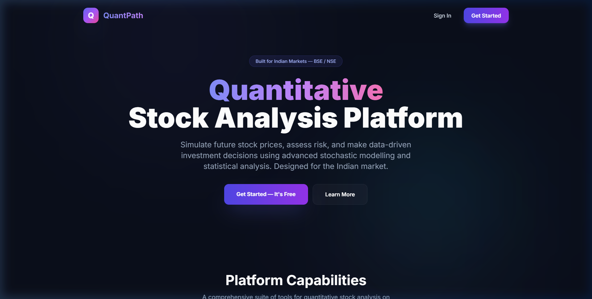

## SYNOPSIS

QuantPath is a comprehensive web-based quantitative stock simulation platform designed to help Indian retail investors, finance students, and educators simulate future stock prices, monitor risk metrics, compare investment options, and maintain complete financial awareness through advanced mathematical modelling.

In today's digital age, where India's stock market is growing at an unprecedented pace with over 10 crore active demat accounts and millions of first-time retail investors entering the market every year, there is a growing need for analytical tools that can provide real-time, data-driven insights into stock price behaviour, volatility, and investment risk. Traditional methods of stock analysis, such as relying on broker recommendations, reading financial news, or performing manual calculations on spreadsheets, are time-consuming, prone to errors, and lack the mathematical sophistication required for effective investment decision-making.

This project addresses these limitations by offering an intuitive, secure, and feature-rich platform that automates stock price simulation, enables intelligent risk monitoring, and generates comprehensive financial insights using four stochastic models — Geometric Brownian Motion (GBM), Ornstein-Uhlenbeck Mean Reversion, Merton Jump Diffusion, and GARCH(1,1) volatility clustering. Personal investment decision-making has become a critical concern for individuals across all income levels and experience backgrounds, as many retail investors struggle with quantifying risk and lack awareness of the statistical range of possible future stock prices, often resulting in uninformed buying and selling decisions, failure to set realistic price targets or stop-loss levels, poor comparison of risk versus return across different stocks, limited understanding of how market volatility and drift affect long-term wealth, and challenges in applying quantitative finance concepts without expensive professional tools.

COLLEGE NAME i | P a g e

---

## TABLE OF CONTENTS

| Sl. No. | Title                                            | Page No. |
| ------- | ------------------------------------------------ | -------- |
| 1.      | Introduction                                     | 1        |
| 2.      | Problem Statement                                | 2        |
| 3.      | Objectives                                       | 3-4      |
| 4.      | System Study                                     | 5-6      |
| 5.      | System Requirements                              | 7        |
| 5.1     | Hardware Requirements                            | 7        |
| 5.2     | Software Requirements                            | 7-8      |
| 6.      | Technology Stack                                 | 9-11     |
| 7.      | System Design                                    | 12       |
| 7.1     | ER Diagram                                       | 13-14    |
| 7.2     | Data Flow Diagram (DFD)                          | 14       |
| 7.2.1   | Level 0 DFD                                      | 14       |
| 7.2.2   | Level 1 DFD                                      | 15       |
| 7.3     | Gantt Chart                                      | 16       |
| 7.4     | Table Design                                     | 17       |
| 8.      | Input/Output Design                              | 18       |
| 8.1     | User Dashboard Code                              | 18-41    |
| 9.      | Expected Outcomes                                | 42-43    |
| 10.     | Testing                                          | 44       |
| 10.1    | Test Cases                                       | 45       |
| 11.     | Validation                                       | 46-47    |
| 11.1    | Input Validation                                 | 46       |
| 11.2    | Form Validation                                  | 46       |
| 11.3    | Data Type Validation                             | 46       |
| 11.4    | Range Validation                                 | 47       |
| 11.5    | Database Validation                              | 47       |
| 11.6    | Error Handling                                   | 47       |
| 12.     | Conclusion & Future Enhancement                  | 48       |
| 12.1    | Conclusion                                       | 48       |
| 12.2    | Future Enhancement                               | 48       |
| 13.     | Bibliography                                     | 49-50    |
| 14.     | Appendices                                       | 51       |
| 14.1    | Screenshots                                      | 52-53    |

COLLEGE NAME ii | P a g e

---

COLLEGE NAME 1 | P a g e

## 1.0 INTRODUCTION

QuantPath is an innovative quantitative finance web application that transforms how Indian retail investors, finance students, and educators interact with stock market data. The platform enables users to simulate future stock prices using four advanced stochastic mathematical models: Monte Carlo simulation based on Geometric Brownian Motion (GBM), Mean Reversion using the Ornstein-Uhlenbeck process, Jump Diffusion based on the Merton model, and GARCH(1,1) volatility clustering.

The application fetches real historical stock price data from the Alpha Vantage API for Indian BSE (Bombay Stock Exchange) and NSE (National Stock Exchange) listed companies. It automatically computes statistical parameters such as annualised drift and volatility from historical log-returns, and generates hundreds of simulated future price trajectories using proper Box-Muller random normal sampling.

QuantPath marks a new era in accessible quantitative finance, merging advanced stochastic modelling with an intuitive web interface to create a powerful yet easy-to-use experience for students, educators, and retail investors alike. All prices are displayed in Indian Rupees (₹).

## 1.1 PROBLEM DEFINITION:

Many Indian retail investors face challenges with making data-driven investment decisions. With over 10 crore demat accounts in India, the majority of investors rely on tips, news headlines, or gut feelings rather than quantitative analysis. Professional tools like Bloomberg Terminal (₹15+ lakhs/year), MATLAB, and QuantLib require expensive licences and deep technical expertise, making them inaccessible to students and individual investors. There is a pressing need for a free, modern, web-based quantitative stock analysis solution to bridge this gap, especially one tailored for the Indian market with BSE/NSE stock support and Indian Rupee pricing.

## 1.2 SCOPE OF THE PROJECT:

- Development of QuantPath: Creation of a comprehensive quantitative stock simulation platform encompassing four stochastic models (GBM, Ornstein-Uhlenbeck, Merton Jump Diffusion, GARCH), real-time stock data fetching, risk metrics computation, and interactive visualisations.
- Academic Utility: Providing students and educators with a practical tool for learning and demonstrating Monte Carlo simulation, stochastic calculus, and risk management concepts using real Indian stock market data.
- Investment Decision Support: Enabling retail investors to simulate stock price ranges, assess risk profiles (VaR, confidence intervals, volatility), and compare stocks before making investment decisions.
- Data Export and Persistence: Allowing users to save simulation results to a database, view simulation history, and export results as CSV files for further analysis in Excel, Python, or R.
- Ongoing Enhancement: Future improvements include portfolio simulation, options pricing (Black-Scholes), machine learning integration (LSTM), mobile app development, and real-time WebSocket data streaming.

COLLEGE NAME 2 | P a g e

## 1.3 MODULES IN THE PROJECT:

- User Authentication Module
- Stock Data Fetching Module
- Simulation Engine Module
- Dashboard Module
- Watchlist Module
- Stock Comparison Module
- User Profile Module
- Data Export Module

## 1.3.1 USER AUTHENTICATION MODULE

This module handles secure user registration and login within the QuantPath system. Users provide their name, email address, and password during registration. The password is securely hashed using bcrypt via PHP's password_hash() function before storage. During login, credentials are verified using prepared statements and password_verify(). Session management includes session_regenerate_id(true) to prevent session fixation attacks.

## 1.3.2 STOCK DATA FETCHING MODULE

This module acts as a proxy between the frontend and the Alpha Vantage API. When a user enters a stock ticker (e.g., RELIANCE.BSE), the module fetches historical daily time series data. A file-based caching system stores API responses for 24 hours (86400 seconds) in the backend/cache/ directory using MD5-hashed filenames, optimising performance and respecting API rate limits.

## 1.3.3 SIMULATION ENGINE MODULE

This is the core analytical engine of QuantPath, implemented entirely in client-side JavaScript for real-time performance. It supports four stochastic models: GBM (Geometric Brownian Motion), Mean Reversion (Ornstein-Uhlenbeck), Jump Diffusion (Merton), and GARCH(1,1). The engine uses Box-Muller Transform for proper normal distribution sampling and computes risk metrics including Expected Price, Median, Standard Deviation, 95% Confidence Interval, and Value at Risk (VaR 5%).

## 1.3.4 DASHBOARD MODULE

This module provides a consolidated overview of the user's simulation activity. It displays aggregate statistics (total simulations, unique stocks, average initial price, average drift), a scrollable list of recent simulations with parameters and results, a watchlist widget, and a stock distribution doughnut chart. Users can download individual simulations as CSV or export all simulations in bulk.

## 1.3.5 WATCHLIST MODULE

This module allows authenticated users to track stocks of interest. Users can add Indian BSE/NSE stock symbols to their personal watchlist, view all tracked stocks with timestamps, and remove stocks. The backend implements full CRUD operations using HTTP methods (GET, POST, DELETE) with a unique constraint on user_id and stock_symbol to prevent duplicates.

COLLEGE NAME 3 | P a g e

## 1.3.6 STOCK COMPARISON MODULE

This module enables side-by-side comparison of 2 to 3 Indian stocks. For each stock, it fetches historical data, auto-calculates drift and volatility from log-returns, runs Monte Carlo GBM simulation, and computes risk metrics. Results are displayed in a comparison table with bar charts for expected returns and volatility, plus risk profile cards classifying each stock as Low, Medium, or High Risk.

## 1.3.7 USER PROFILE MODULE

This module allows users to view and edit their personal information including name, bio, phone number, and institution. The profile page displays account statistics such as total simulations run, watchlist count, and unique stocks analysed. The backend provides a RESTful GET/POST interface.

## 1.3.8 DATA EXPORT MODULE

This module enables downloading simulation results as CSV files containing stock ticker, simulation parameters (S0, mu, sigma, paths, horizon), computed risk metrics (mean, median, stddev, CI, VaR), and all terminal simulated prices. The CSV format is compatible with Excel, Python (pandas), and R.

COLLEGE NAME 4 | P a g e

## 2.0 SYSTEM STUDY

## 2.1 EXISTING SYSTEM STUDY

- In the existing systems, most quantitative finance tools are designed for US/European markets (NYSE, NASDAQ) and do not natively support Indian BSE/NSE stock tickers or display results in Indian Rupees. These tools present various challenges:
- Expensive Professional Software: Bloomberg Terminal costs over ₹15 lakhs/year. MATLAB and its Financial Toolbox require costly academic or commercial licences. These are completely out of reach for most Indian students and individual investors.
- High Technical Barrier: Open-source libraries like QuantLib are written in C++ and require advanced programming skills. They have steep learning curves unsuitable for beginners or finance students who only know spreadsheets.
- Limited Online Tools: Existing stock screeners (Screener.in, Moneycontrol) provide fundamental analysis but do not offer Monte Carlo simulation, stochastic modelling, or risk analytics capabilities.
- Manual Processes: Without automated tools, performing Monte Carlo simulation requires manually downloading stock data, computing log-returns in Excel, calculating drift and volatility, and writing custom code — a time-consuming and error-prone process.
- No Integrated Solution: No existing free web-based tool combines real-time Indian stock data fetching, multiple stochastic model selection, automatic parameter estimation, interactive charting, risk metric computation, and simulation persistence in a single integrated platform.

## 2.2. FEASIBILITY STUDY:

A feasibility study is an analysis of how successfully a project can be completed, accounting for factors that affect it such as economic, technological, legal and scheduling factors. Project managers use feasibility studies to determine potential positive and negative outcomes of a project before investing a considerable amount of time and money into it.

- Technical Feasibility:
  The technology stack (PHP 8.x, MySQL/MariaDB, JavaScript ES6+, HTML5, Tailwind CSS, Chart.js) is well-established, mature, and widely supported. XAMPP provides a free, cross-platform development environment. The Alpha Vantage API offers a free tier with adequate daily request limits. All stochastic models (GBM, OU, Merton, GARCH) have well-established mathematical formulations implementable in JavaScript. Modern browsers fully support the required ES6+ features.

COLLEGE NAME 5 | P a g e

- Economic Feasibility:
  All technologies used are free and open-source (PHP, MySQL, JavaScript, Chart.js, Tailwind CSS CDN). Alpha Vantage API provides free API keys for limited usage. XAMPP is free to download. No hosting costs required as the application runs on localhost. Total development cost is limited to the developer's time and existing hardware.

- Behavioral feasibility:
  The target users (students, investors, educators) are familiar with web-based interfaces and can operate the platform without specialised training. The premium dark UI design with glassmorphism effects provides an engaging experience. Form inputs include placeholder values and helper text to guide users. Toast notifications provide immediate feedback on all actions.

- Schedule feasibility:
  The project is structured modularly, allowing parallel development of frontend and backend components. The technology stack has minimal configuration overhead. Database migration tools enable rapid setup and schema changes.

Every project is feasible for given unlimited resources and infinite time. Feasibility study is an evaluation of the proposed system regarding its workability, impact on the organization, ability to meet the user needs and effective use of resources.

SCHEDULE-Time duration of this project requires approximately 16 weeks covering 2 weeks for requirements and planning, 2 weeks for database and backend setup, 4 weeks for core simulation engine, 4 weeks for frontend development, 2 weeks for API integration and comparison features, and 2 weeks for testing and documentation.

## 2.3 PROPOSED SYSTEM:

The proposed system has got the following advantages over the existing system

- Free and open-source — no licence fees or subscription costs
- Works with real Indian BSE/NSE stock data and displays results in Indian Rupees (₹)
- Supports four stochastic simulation models in a single unified interface
- Auto-calculates drift and volatility from historical data
- Provides interactive Chart.js visualisations with confidence bands
- Secure authentication with bcrypt password hashing
- Easy to set up using XAMPP on localhost

COLLEGE NAME 6 | P a g e

## 3.0 SYSTEM DESIGN

In the design phase the architecture is established. This phase starts with the requirement document delivered by the requirement phase and maps the requirements into an architecture. The architecture defines the components, their interfaces and behaviors.

QuantPath follows a three-tier client-server architecture:

Frontend Layer (Presentation): HTML5, Tailwind CSS (via CDN), JavaScript ES6+, Inter font from Google Fonts, Chart.js 4.x for interactive visualisations, glassmorphism design with dark theme (#0a0e1a background), sidebar navigation pattern.

Backend Layer (Business Logic): PHP 8.x running on Apache (XAMPP), RESTful API endpoints returning JSON responses, session-based authentication with PHP sessions, Alpha Vantage API proxy with file-based caching.

Database Layer (Data Storage): MySQL/MariaDB with UTF-8 (utf8mb4) character encoding, four tables (users, simulations, watchlist, comparisons), foreign key relationships with CASCADE delete, JSON columns for flexible parameter and result storage.

The design document describes a plan to implement the requirements. System design is the process of defining the architecture components, modules, interfaces, and data for a system to satisfy specified requirements.

## 3.1 ER DIAGRAM

An entity relationship diagram (ERD) shows the relationships of entity sets stored in a database. An entity in this context is a component of data. ER diagrams illustrate the logical structure of databases.

The QuantPath database consists of four entities:

- USERS: id, name, email, password_hash, bio, avatar_url, phone, institution, created_at
- SIMULATIONS: id, user_id (FK→users), stock_symbol, model_used, parameters (JSON), results_json (JSON), created_at
- WATCHLIST: id, user_id (FK→users), stock_symbol, added_at, UNIQUE(user_id, stock_symbol)
- COMPARISONS: id, user_id (FK→users), title, simulation_ids (JSON), created_at

Relationships: Users →(1:N)→ Simulations, Users →(1:N)→ Watchlist, Users →(1:N)→ Comparisons. All foreign keys have ON DELETE CASCADE.

COLLEGE NAME 7 | P a g e

## 3.1.1 ER DIAGRAM FOR QUANTPATH

(Insert ER Diagram Here)

## 3.2 TABLE DESIGN

TABLE: users

| Column Name   | Data Type    | Constraints                 |
| ------------- | ------------ | --------------------------- |
| id            | INT          | PRIMARY KEY, AUTO_INCREMENT |
| name          | VARCHAR(100) | NOT NULL                    |
| email         | VARCHAR(100) | UNIQUE, NOT NULL            |
| password_hash | VARCHAR(255) | NOT NULL                    |
| bio           | TEXT         | DEFAULT NULL                |
| avatar_url    | VARCHAR(255) | DEFAULT NULL                |
| phone         | VARCHAR(20)  | DEFAULT NULL                |
| institution   | VARCHAR(200) | DEFAULT NULL                |
| created_at    | TIMESTAMP    | DEFAULT CURRENT_TIMESTAMP   |

TABLE: simulations

| Column Name  | Data Type   | Constraints                      |
| ------------ | ----------- | -------------------------------- |
| id           | INT         | PRIMARY KEY, AUTO_INCREMENT      |
| user_id      | INT         | FK → users(id) ON DELETE CASCADE |
| stock_symbol | VARCHAR(20) | NOT NULL                         |
| model_used   | VARCHAR(50) | NOT NULL                         |
| parameters   | JSON        | NOT NULL                         |
| results_json | JSON        | NOT NULL                         |
| created_at   | TIMESTAMP   | DEFAULT CURRENT_TIMESTAMP        |

TABLE: watchlist

| Column Name  | Data Type   | Constraints                      |
| ------------ | ----------- | -------------------------------- |
| id           | INT         | PRIMARY KEY, AUTO_INCREMENT      |
| user_id      | INT         | FK → users(id) ON DELETE CASCADE |
| stock_symbol | VARCHAR(20) | NOT NULL                         |
| added_at     | TIMESTAMP   | DEFAULT CURRENT_TIMESTAMP        |
| UNIQUE KEY   |             | (user_id, stock_symbol)          |

TABLE: comparisons

| Column Name    | Data Type    | Constraints                      |
| -------------- | ------------ | -------------------------------- |
| id             | INT          | PRIMARY KEY, AUTO_INCREMENT      |
| user_id        | INT          | FK → users(id) ON DELETE CASCADE |
| title          | VARCHAR(200) | DEFAULT 'Untitled Comparison'    |
| simulation_ids | JSON         | NOT NULL                         |
| created_at     | TIMESTAMP    | DEFAULT CURRENT_TIMESTAMP        |

COLLEGE NAME 8 | P a g e

## 3.3 DATA FLOW DIAGRAM (LEVEL 0 AND LEVEL 1)

The Data Flow Diagrams (DFDs) are used for structure analysis and design. DFDs show the flow of data from external entities into the system. DFDs also show how the data moves and is transformed from one process to another, as well as its logical storage.

A data flow diagram (DFD) is a graphical representation of the "flow" of data through an information system, modelling its process aspects. A DFD shows what kind of information will be input to and output from the system, where the data will come from and go to, and where the data will be stored.

## 3.3.1 LEVEL-0 DFD

The context diagram shows QuantPath as a single process interacting with two external entities:

- User: Provides credentials, stock tickers, simulation parameters. Receives simulation results, risk metrics, charts, CSV exports.
- Alpha Vantage API: Receives stock ticker requests. Returns historical daily stock price data in JSON format.

(Insert Level 0 DFD Here)

## 3.3.2 LEVEL 1 DFD's

- Level 1 DFD's aim to give an overview of the full system. They look at the system in more detail. Major processes are broken down into subprocesses:

Process 1.0 — User Authentication: Input credentials → Verify → Create session → Data Store: Users table
Process 2.0 — Stock Data Retrieval: Input ticker → Check cache → Fetch from API → Store in cache
Process 3.0 — Parameter Estimation: Input prices → Calculate log-returns → Compute drift, volatility, RSI
Process 4.0 — Simulation Engine: Input parameters → Run Monte Carlo → Generate price paths
Process 5.0 — Results Computation: Input terminal prices → Compute mean, median, stddev, CI, VaR
Process 6.0 — Data Persistence: Input results → Save to DB → Export as CSV

(Insert Level 1 DFD Here)

COLLEGE NAME 9 | P a g e

## 3.4 GANTT CHART:

A Gantt chart is a type of bar chart that illustrates a project schedule. Gantt charts illustrate the start and finish dates of the terminal elements and summary elements of a project.

Phase 1 — Requirements and Planning (Weeks 1-2)
Phase 2 — Database and Backend Setup (Weeks 3-4)
Phase 3 — Core Simulation Engine (Weeks 5-8)
Phase 4 — Frontend Development (Weeks 6-10)
Phase 5 — API Integration (Weeks 9-10)
Phase 6 — Comparison and Watchlist Features (Weeks 11-12)
Phase 7 — Testing and Debugging (Weeks 13-14)
Phase 8 — Documentation and Deployment (Weeks 15-16)

(Insert Gantt Chart Here)

COLLEGE NAME 10 | P a g e

## 3.5 INPUT/OUTPUT DESIGN

## 3.5.1 USER LOGIN AND REGISTRATION CODE

```
<?php
// backend/login.php
session_start();
require_once __DIR__ . '/../private_config/config.php';
header('Content-Type: application/json');

$raw = file_get_contents('php://input');
$input = json_decode($raw, true) ?: $_POST;

$email = trim($input['email'] ?? '');
$password = $input['password'] ?? '';

if (!$email || !$password) {
    http_response_code(400);
    echo json_encode(['error'=>'Missing credentials']);
    exit;
}

$stmt = $conn->prepare("SELECT id,name,password_hash FROM users WHERE email = ?");
$stmt->bind_param('s', $email);
$stmt->execute();
$stmt->store_result();

if ($stmt->num_rows === 0) {
    http_response_code(401);
    echo json_encode(['error'=>'Invalid credentials']);
    exit;
}

$stmt->bind_result($id, $name, $hash);
$stmt->fetch();

if (!password_verify($password, $hash)) {
    http_response_code(401);
    echo json_encode(['error'=>'Invalid credentials']);
    exit;
}

session_regenerate_id(true);
$_SESSION['user_id'] = $id;
$_SESSION['user_name'] = $name;
$_SESSION['user_email'] = $email;

echo json_encode(['ok'=>true, 'user'=>['id'=>$id, 'name'=>$name]]);
$stmt->close();
$conn->close();
?>
```

COLLEGE NAME 11 | P a g e

```
<?php
// backend/register.php
require_once __DIR__ . '/../private_config/config.php';
header('Content-Type: application/json');

$name = trim($_POST['name'] ?? '');
$email = trim($_POST['email'] ?? '');
$password = $_POST['password'] ?? '';

if (!$name || !$email || !$password) {
    http_response_code(400);
    echo json_encode(['error'=>'Missing fields']);
    exit;
}

if (!filter_var($email, FILTER_VALIDATE_EMAIL)) {
    http_response_code(400);
    echo json_encode(['error'=>'Invalid email']);
    exit;
}

$stmt = $conn->prepare("SELECT id FROM users WHERE email = ?");
$stmt->bind_param('s', $email);
$stmt->execute();
$stmt->store_result();

if ($stmt->num_rows > 0) {
    http_response_code(409);
    echo json_encode(['error'=>'Email already registered']);
    exit;
}
$stmt->close();

$hash = password_hash($password, PASSWORD_BCRYPT);
$stmt = $conn->prepare("INSERT INTO users (name,email,password_hash) VALUES (?,?,?)");
$stmt->bind_param('sss', $name, $email, $hash);

if ($stmt->execute()) echo json_encode(['ok'=>true]);
else { http_response_code(500); echo json_encode(['error'=>'Registration failed']); }

$stmt->close();
$conn->close();
?>
```

COLLEGE NAME 12 | P a g e

## FORM DESIGN:

LOGIN PAGE:



REGISTRATION PAGE:



COLLEGE NAME 13 | P a g e

## 3.5.2 DASHBOARD CODE

```
<?php
// frontend/dashboard.php
session_start();
require_once __DIR__ . '/../private_config/config.php';

$simulations = [];
$user_name = '';
$user_id = '';
$stats = ['total' => 0, 'avgExpected' => 0, 'totalDrift' => 0];
$tracked_stocks = [];
$stock_count = 0;
$watchlist_items = [];

if (!empty($_SESSION['user_id'])) {
    $user_id = $_SESSION['user_id'];
    $user_name = $_SESSION['user_name'] ?? 'User';

    // Fetch simulations
    $stmt = $conn->prepare(
        "SELECT id, stock_symbol, model_used, parameters, results_json, created_at
         FROM simulations WHERE user_id=? ORDER BY created_at DESC"
    );
    $stmt->bind_param('i', $user_id);
    $stmt->execute();
    $simulations = $stmt->get_result()->fetch_all(MYSQLI_ASSOC);
    $stmt->close();

    $stats['total'] = count($simulations);
    $stock_symbols = [];

    if ($stats['total'] > 0) {
        $avgExp = 0; $avgDrift = 0;
        foreach ($simulations as $s) {
            $params = json_decode($s['parameters'], true);
            $avgExp += $params['S0'] ?? 0;
            $avgDrift += $params['mu'] ?? 0;
            $stock_symbols[] = $s['stock_symbol'];
        }
        $stats['avgExpected'] = round($avgExp / $stats['total'], 2);
        $stats['totalDrift'] = round($avgDrift / $stats['total'], 4);
        $tracked_stocks = array_unique($stock_symbols);
        $stock_count = count($tracked_stocks);
    }

    // Fetch watchlist
    $stmt2 = $conn->prepare(
        "SELECT id, stock_symbol, added_at
         FROM watchlist WHERE user_id=? ORDER BY added_at DESC LIMIT 10"
    );
    $stmt2->bind_param('i', $user_id);
    $stmt2->execute();
    $watchlist_items = $stmt2->get_result()->fetch_all(MYSQLI_ASSOC);
    $stmt2->close();
}

$conn->close();
?>
```

COLLEGE NAME 14 | P a g e

## FORM DESIGN



COLLEGE NAME 15 | P a g e

## 3.5.3 STOCK DATA FETCHING CODE:

```
<?php
// backend/fetch_stock.php — Fetch stock data from Alpha Vantage
header('Content-Type: application/json');

$symbol = trim($_GET['symbol'] ?? '');
if (!$symbol) {
    http_response_code(400);
    echo json_encode(['error'=>'Missing symbol']);
    exit;
}

require_once __DIR__ . '/../private_config/config.php';

$apiKey = $ALPHA_VANTAGE_API_KEY ?? '';
if (!$apiKey) {
    http_response_code(500);
    echo json_encode(['error' => 'Alpha Vantage API key not configured']);
    exit;
}

$function = $_GET['function'] ?? 'TIME_SERIES_DAILY';
$outputsize = $_GET['outputsize'] ?? 'compact';

// Cache configuration
$cacheDir = __DIR__ . '/cache';
$cacheFile = $cacheDir . '/' . md5($symbol . '_' . $function . '_' . $outputsize) . '.json';
$cacheTime = 86400; // 24 hours

if (file_exists($cacheFile) && (time() - filemtime($cacheFile)) < $cacheTime) {
    echo file_get_contents($cacheFile);
    exit;
}

// Build URL
$url = "https://www.alphavantage.co/query?function=" . urlencode($function)
     . "&symbol=" . urlencode($symbol)
     . "&outputsize=" . urlencode($outputsize)
     . "&apikey=" . $apiKey;

$opts = ['http'=>['timeout'=>15, 'ignore_errors'=>true]];
$context = stream_context_create($opts);
$response = @file_get_contents($url, false, $context);

if ($response === false) {
    http_response_code(502);
    echo json_encode(['error'=>'API fetch failed']);
    exit;
}

$data = json_decode($response, true);

// Check for Alpha Vantage error messages
if (isset($data['Error Message'])) {
    http_response_code(400);
    echo json_encode(['error' => $data['Error Message']]);
    exit;
}

if (isset($data['Note']) || isset($data['Information'])) {
    http_response_code(429);
    echo json_encode(['error' => 'API rate limit reached. Please wait and try again.']);
    exit;
}

// Save to cache
if (!empty($data) && !isset($data['error'])) {
    @file_put_contents($cacheFile, $response);
}

echo $response;
?>
```

COLLEGE NAME 16 | P a g e

## 3.5.4 SIMULATION ENGINE CODE (MONTE CARLO GBM):

```
// Box-Muller Transform for normal distribution
function randNormal() {
  let u = 0, v = 0;
  while (u === 0) u = Math.random();
  while (v === 0) v = Math.random();
  return Math.sqrt(-2 * Math.log(u)) * Math.cos(2 * Math.PI * v);
}

// Run Monte Carlo Simulation
const model = document.getElementById('model-select').value;
const s0 = parseFloat(document.getElementById('s0').value) || 2500;
const mu = parseFloat(document.getElementById('mu').value) || 0.12;
const sigma = parseFloat(document.getElementById('sigma').value) || 0.25;
const numPaths = parseInt(document.getElementById('paths').value) || 500;
const T = parseFloat(document.getElementById('horizon').value) || 1;
const steps = Math.round(252 * T);
const dt = T / steps;

const simResults = [];
const allPaths = [];

for (let i = 0; i < numPaths; i++) {
  let S = s0;
  const path = [s0];

  if (model === 'gbm') {
    // Geometric Brownian Motion
    for (let t = 0; t < steps; t++) {
      const Z = randNormal();
      S = S * Math.exp((mu - 0.5 * sigma * sigma) * dt + sigma * Math.sqrt(dt) * Z);
      path.push(S);
    }
  } else if (model === 'mean-reversion') {
    // Ornstein-Uhlenbeck Mean Reversion
    const theta = parseFloat(document.getElementById('mr-theta').value) || s0;
    const kappa = parseFloat(document.getElementById('mr-kappa').value) || 2.0;
    for (let t = 0; t < steps; t++) {
      const Z = randNormal();
      S = S + kappa * (theta - S) * dt + sigma * S * Math.sqrt(dt) * Z;
      if (S < 0) S = 0.01;
      path.push(S);
    }
  } else if (model === 'jump-diffusion') {
    // Merton Jump Diffusion
    const lambdaJ = parseFloat(document.getElementById('jd-lambda').value) || 1.0;
    const jumpMu = parseFloat(document.getElementById('jd-jumpmu').value) || -0.05;
    const jumpSigma = parseFloat(document.getElementById('jd-jumpsigma').value) || 0.1;
    for (let t = 0; t < steps; t++) {
      const Z = randNormal();
      const jump = Math.random() < lambdaJ * dt
        ? Math.exp(jumpMu + jumpSigma * randNormal()) - 1 : 0;
      S = S * Math.exp((mu - 0.5 * sigma * sigma) * dt
        + sigma * Math.sqrt(dt) * Z) * (1 + jump);
      if (S < 0) S = 0.01;
      path.push(S);
    }
  } else if (model === 'garch') {
    // GARCH(1,1) Volatility Clustering
    const omega = parseFloat(document.getElementById('garch-omega').value) || 0.00001;
    const alpha = parseFloat(document.getElementById('garch-alpha').value) || 0.1;
    const beta = parseFloat(document.getElementById('garch-beta').value) || 0.85;
    let h = sigma * sigma / 252;
    let prevReturn = 0;
    for (let t = 0; t < steps; t++) {
      h = omega + alpha * prevReturn * prevReturn + beta * h;
      const dailyVol = Math.sqrt(h);
      const Z = randNormal();
      const ret = (mu / 252) + dailyVol * Z;
      prevReturn = ret;
      S = S * Math.exp(ret);
      if (S < 0) S = 0.01;
      path.push(S);
    }
  }

  simResults.push(S);
  if (i < 50) allPaths.push(path);
}

// Compute risk metrics
simResults.sort((a, b) => a - b);
const mean = simResults.reduce((a, b) => a + b, 0) / simResults.length;
const median = simResults[Math.floor(simResults.length / 2)];
const variance = simResults.reduce((a, b) => a + Math.pow(b - mean, 2), 0) / simResults.length;
const stddev = Math.sqrt(variance);
const ci95Low = simResults[Math.floor(simResults.length * 0.025)];
const ci95High = simResults[Math.floor(simResults.length * 0.975)];
const var5 = simResults[Math.floor(simResults.length * 0.05)];
```

COLLEGE NAME 17 | P a g e

## FORM DESIGN

SIMULATION PAGE:



COLLEGE NAME 18 | P a g e

## 3.5.5 RSI CALCULATION CODE:

```
// RSI Calculation using Wilder's Smoothing Method
function calculateRSI(prices, period = 14) {
  if (prices.length < period + 1) return null;
  const changes = [];
  for (let i = 1; i < prices.length; i++) {
    changes.push(prices[i] - prices[i - 1]);
  }
  // Initial average gain/loss
  let avgGain = 0, avgLoss = 0;
  for (let i = 0; i < period; i++) {
    if (changes[i] > 0) avgGain += changes[i];
    else avgLoss += Math.abs(changes[i]);
  }
  avgGain /= period;
  avgLoss /= period;
  // Smoothed RSI (Wilder's method)
  for (let i = period; i < changes.length; i++) {
    const change = changes[i];
    avgGain = (avgGain * (period - 1) + (change > 0 ? change : 0)) / period;
    avgLoss = (avgLoss * (period - 1) + (change < 0 ? Math.abs(change) : 0)) / period;
  }
  if (avgLoss === 0) return 100;
  const rs = avgGain / avgLoss;
  return 100 - (100 / (1 + rs));
}
```

COLLEGE NAME 19 | P a g e

## 3.5.6 WATCHLIST CRUD CODE:

```
<?php
// backend/watchlist.php — CRUD for user's stock watchlist
session_start();
header('Content-Type: application/json');
require_once __DIR__ . '/../private_config/config.php';

$user_id = $_SESSION['user_id'] ?? null;
if (!$user_id) {
    http_response_code(401);
    echo json_encode(['error'=>'Not logged in']);
    exit;
}

$method = $_SERVER['REQUEST_METHOD'];

if ($method === 'GET') {
    // Get all watchlist items
    $stmt = $conn->prepare(
        "SELECT id, stock_symbol, added_at FROM watchlist WHERE user_id=? ORDER BY added_at DESC"
    );
    $stmt->bind_param('i', $user_id);
    $stmt->execute();
    $result = $stmt->get_result();
    $items = $result->fetch_all(MYSQLI_ASSOC);
    $stmt->close();
    $conn->close();
    echo json_encode(['watchlist' => $items]);
    exit;
}

if ($method === 'POST') {
    $input = json_decode(file_get_contents('php://input'), true);
    $symbol = strtoupper(trim($input['symbol'] ?? ''));
    if (!$symbol) {
        http_response_code(400);
        echo json_encode(['error'=>'Missing symbol']);
        exit;
    }
    $stmt = $conn->prepare("INSERT IGNORE INTO watchlist (user_id, stock_symbol) VALUES (?, ?)");
    $stmt->bind_param('is', $user_id, $symbol);
    $stmt->execute();
    $inserted = $stmt->affected_rows > 0;
    $stmt->close();
    $conn->close();
    echo json_encode(['status' => $inserted ? 'added' : 'already_exists', 'symbol' => $symbol]);
    exit;
}

if ($method === 'DELETE') {
    $input = json_decode(file_get_contents('php://input'), true);
    $symbol = strtoupper(trim($input['symbol'] ?? ''));
    if (!$symbol) {
        http_response_code(400);
        echo json_encode(['error'=>'Missing symbol']);
        exit;
    }
    $stmt = $conn->prepare("DELETE FROM watchlist WHERE user_id=? AND stock_symbol=?");
    $stmt->bind_param('is', $user_id, $symbol);
    $stmt->execute();
    $deleted = $stmt->affected_rows > 0;
    $stmt->close();
    $conn->close();
    echo json_encode(['status' => $deleted ? 'removed' : 'not_found']);
    exit;
}

http_response_code(405);
echo json_encode(['error'=>'Method not allowed']);
?>
```

COLLEGE NAME 20 | P a g e

## FORM DESIGN

WATCHLIST PAGE:



COLLEGE NAME 21 | P a g e

## 3.5.7 STOCK COMPARISON CODE:

```
// Compare Stocks — Monte Carlo simulation for 2-3 stocks
document.getElementById('compare-btn').addEventListener('click', async () => {
  let s1 = document.getElementById('stock1').value.trim().toUpperCase() || 'RELIANCE.BSE';
  let s2 = document.getElementById('stock2').value.trim().toUpperCase() || 'TCS.BSE';
  let s3 = document.getElementById('stock3').value.trim().toUpperCase();

  const appendSuffix = (sym) => sym && !sym.includes('.') ? sym + '.BSE' : sym;
  s1 = appendSuffix(s1);
  s2 = appendSuffix(s2);
  s3 = appendSuffix(s3);

  const tickers = [s1, s2];
  if (s3) tickers.push(s3);

  const numPaths = parseInt(document.getElementById('paths').value) || 250;
  const T = parseFloat(document.getElementById('horizon').value) || 1;
  const steps = Math.round(252 * T);
  const dt = T / steps;

  const sims = [];

  // Fetch data and configure models
  for (const ticker of tickers) {
    const data = await API.fetchStock(ticker);
    const tsKey = Object.keys(data).find(k => k.includes('Time Series'));
    const ts = data[tsKey];
    const dates = Object.keys(ts).sort();
    const prices = dates.map(d => parseFloat(ts[d]['4. close']));

    const S0 = prices[prices.length - 1];
    const returns = [];
    for (let i = 1; i < prices.length; i++) {
      returns.push(Math.log(prices[i] / prices[i - 1]));
    }
    const avgReturn = returns.reduce((a, b) => a + b, 0) / returns.length;
    const variance = returns.reduce((a, b) => a + Math.pow(b - avgReturn, 2), 0) / (returns.length - 1);
    const mu = avgReturn * 252;
    const sigma = Math.sqrt(variance) * Math.sqrt(252);

    sims.push({ symbol: ticker, S0, mu, sigma });
  }

  // Run Simulations for each stock
  for (const sim of sims) {
    const results = [];
    for (let i = 0; i < numPaths; i++) {
      let S = sim.S0;
      for (let t = 0; t < steps; t++) {
        S = S * Math.exp((sim.mu - 0.5 * sim.sigma * sim.sigma) * dt
          + sim.sigma * Math.sqrt(dt) * randNormal());
      }
      results.push(S);
    }
    results.sort((a, b) => a - b);
    sim.mean = results.reduce((a, b) => a + b, 0) / results.length;
    sim.var5 = results[Math.floor(results.length * 0.05)];
    sim.expectedReturnPct = ((sim.mean - sim.S0) / sim.S0) * 100;
  }
});
```

COLLEGE NAME 22 | P a g e

## FORM DESIGN

COMPARE STOCKS PAGE:



COLLEGE NAME 23 | P a g e

## 3.5.8 API WRAPPER AND TOAST SYSTEM CODE:

```
// assets/js/api.js — API wrapper for QuantPath backend endpoints
const API = (function () {
  const base = "/quantpath/backend";

  async function postJson(url, payload) {
    const res = await fetch(url, {
      method: "POST",
      headers: { "Content-Type": "application/json" },
      credentials: "same-origin",
      body: JSON.stringify(payload),
    });
    const data = await res.json().catch(() => { throw new Error("Invalid JSON response"); });
    if (!res.ok) throw new Error(data.error || "Request failed");
    return data;
  }

  async function getJson(url) {
    const res = await fetch(url, { credentials: "same-origin" });
    const data = await res.json().catch(() => { throw new Error("Invalid JSON response"); });
    if (!res.ok) throw new Error(data.error || "Request failed");
    return data;
  }

  return {
    register: (name, email, password) => {
      const form = new FormData();
      form.append("name", name);
      form.append("email", email);
      form.append("password", password);
      return formPost(`${base}/register.php`, form);
    },
    login: (email, password) => postJson(`${base}/login.php`, { email, password }),
    fetchStock: (symbol, outputsize = "compact") =>
      getJson(`${base}/fetch_stock.php?symbol=${encodeURIComponent(symbol)}&outputsize=${outputsize}`),
    saveSimulation: (payload) => postJson(`${base}/save_simulation.php`, payload),
    getSimulations: () => getJson(`${base}/get_simulations.php`),
    deleteSimulation: (id) => postJson(`${base}/delete_simulation.php`, { id }),
    getWatchlist: () => getJson(`${base}/watchlist.php`),
    addToWatchlist: (symbol) => postJson(`${base}/watchlist.php`, { symbol }),
    getProfile: () => getJson(`${base}/profile.php`),
    updateProfile: (data) => postJson(`${base}/profile.php`, data),
  };
})();

// Toast notification system
const Toast = {
  container: null,
  init() {
    if (this.container) return;
    this.container = document.createElement("div");
    this.container.style.cssText =
      "position:fixed;top:24px;right:24px;z-index:9999;display:flex;flex-direction:column;gap:8px;";
    document.body.appendChild(this.container);
  },
  show(message, type = "info", duration = 3000) {
    this.init();
    const toast = document.createElement("div");
    const colors = {
      success: "linear-gradient(135deg, #059669, #10b981)",
      error: "linear-gradient(135deg, #dc2626, #ef4444)",
      info: "linear-gradient(135deg, #4f46e5, #6366f1)",
    };
    toast.style.cssText = `background:${colors[type]};color:white;padding:12px 20px;
      border-radius:12px;font-size:14px;font-weight:500;box-shadow:0 10px 40px rgba(0,0,0,0.3);
      transform:translateX(120%);transition:transform 0.3s;min-width:250px;`;
    toast.textContent = message;
    this.container.appendChild(toast);
    requestAnimationFrame(() => { toast.style.transform = "translateX(0)"; });
    setTimeout(() => {
      toast.style.transform = "translateX(120%)";
      setTimeout(() => toast.remove(), 300);
    }, duration);
  },
};
```

COLLEGE NAME 24 | P a g e

## FORM DESIGN

PROFILE PAGE:



LANDING PAGE:



COLLEGE NAME 25 | P a g e

## 4.0 SYSTEM CONFIGURATION

## 4.1 HARDWARE REQUIREMENTS

| Component     | Specification                         |
| ------------- | ------------------------------------- |
| PROCESSOR     | INTEL CORE i3 or equivalent (minimum) |
| INSTALLED RAM | 4GB minimum, 8GB recommended          |
| HARD DISK     | 500 MB free space                     |
| SYSTEM TYPE   | 64 BIT OPERATING SYSTEM               |
| DISPLAY       | 1366 x 768 minimum resolution         |
| NETWORK       | Internet connection for API access    |

## 4.2 SOFTWARE REQUIREMENTS

| Component        | Specification                                      |
| ---------------- | -------------------------------------------------- |
| FRONT END        | HTML5, JavaScript ES6+, Tailwind CSS, Chart.js 4.x |
| BACK END         | PHP 8.x, MySQL / MariaDB                           |
| WEB SERVER       | Apache 2.4+ (XAMPP)                                |
| OPERATING SYSTEM | Windows 10/11, macOS, or Linux                     |
| API SERVICE      | Alpha Vantage API (free key)                       |
| WEB BROWSER      | Chrome 90+, Firefox 85+, Edge 90+                  |
| IDE              | Visual Studio Code                                 |

COLLEGE NAME 26 | P a g e

## 5. DETAILS OF SOFTWARE

## 5.1 OVERVIEW OF FRONT-END

The frontend of QuantPath is built using modern web technologies. HTML5 provides the structural foundation for all seven pages (landing, login, registration, dashboard, simulation, watchlist, compare, profile). Tailwind CSS is loaded via CDN (cdn.tailwindcss.com) and provides utility-first CSS classes for rapid styling with a premium dark theme (#0a0e1a background) and glassmorphism effects using backdrop-filter: blur(20px).

JavaScript ES6+ handles all simulation computations, chart rendering, API communication, and DOM manipulation. Key features include Box-Muller Transform for normal distribution, four stochastic model implementations, Wilder's RSI calculation, async/await for API calls, and Blob API for CSV generation.

Chart.js 4.x is used for all data visualisations — line charts for Monte Carlo price paths, bar charts for terminal price distributions, doughnut charts for stock distribution on the dashboard, and bar charts for comparison views.

The Inter font family from Google Fonts is used across all pages for modern, clean typography. The API.js module provides a centralised API wrapper using the JavaScript module pattern (IIFE) with methods for all backend endpoints, plus a Toast notification system for user feedback.

## FEATURES

- Interactive Monte Carlo simulation with 4 stochastic models
- Real-time Chart.js visualisations with confidence bands
- RSI gauge with overbought/oversold indicators
- Premium glassmorphism dark UI design
- Responsive sidebar navigation
- Toast notification system
- CSV export functionality

COLLEGE NAME 27 | P a g e

## 5.2 OVERVIEW OF BACK-END

PHP 8.x running on Apache (via XAMPP) handles all server-side logic including user authentication with bcrypt password hashing, database CRUD operations using MySQLi prepared statements, Alpha Vantage API proxy with file-based caching (24-hour TTL), JSON request/response handling, and input validation.

MySQL/MariaDB provides persistent data storage with UTF-8 (utf8mb4) character encoding, four tables with proper foreign key constraints and CASCADE deletes, JSON columns for flexible parameter and result storage, and unique constraints to prevent duplicate watchlist entries.

The Alpha Vantage API provides real-time and historical stock data via the TIME_SERIES_DAILY function. It supports Indian BSE stocks with .BSE ticker suffix. API responses are cached locally as JSON files using MD5-hashed filenames for 24 hours to minimise API calls and improve response times.

PHP sessions provide authentication state management. session_start() initialises or resumes sessions, session_regenerate_id(true) prevents session fixation attacks, and protected endpoints check $\_SESSION['user_id'] before processing requests.

## FEATURES

- RESTful JSON API endpoints
- Prepared statements for SQL injection prevention
- bcrypt password hashing (PASSWORD_BCRYPT)
- File-based API response caching
- Session-based authentication
- Database migration tools (setup_db.php, migrate.php)
- India-specific configuration (₹ currency, BSE default exchange)

COLLEGE NAME 28 | P a g e

## 6. TESTING

Testing is a vital part of software development, and it is important to start it as early as possible. The tools and techniques used ensure the QuantPath application is reliable, secure, and performs as expected across different scenarios.

## SOFTWARE TESTING TYPES:

## 1. FUNCTIONAL TESTING

This type of testing focuses on the output and whether it meets requirements:

- Unit Testing: Individual modules tested in isolation — login authentication, registration validation, stock data fetching, simulation computation accuracy, watchlist CRUD operations, and CSV export generation.
- Integration Testing: Testing the flow between modules — fetching stock data → auto-filling parameters → running simulation → saving results → viewing on dashboard.
- System Testing: Entire QuantPath system tested end-to-end covering all user workflows from registration to simulation export.
- Black Box Testing: Testing without knowledge of internal code — verifying that correct inputs produce expected outputs (e.g., entering RELIANCE.BSE returns valid stock data, running simulation produces reasonable price paths).

## 2. NON-FUNCTIONAL TESTING

- Security Testing: Verified bcrypt password hashing, session regeneration, prepared statement SQL injection prevention, API key protection, and input sanitisation.
- Usability Testing: Verified intuitive navigation with sidebar, clear form labels with placeholder text, toast notification feedback, responsive design on different screen sizes, and accessible colour contrast.
- Performance Testing: Verified simulation engine handles 500+ paths in real-time, API caching reduces response times, Chart.js renders smoothly with 50 plotted paths.

## 6.1 TEST CASES

| Test Case              | Input                                   | Expected Output                        | Result |
| ---------------------- | --------------------------------------- | -------------------------------------- | ------ |
| Valid Login            | Correct email and password              | Redirect to dashboard                  | PASS   |
| Invalid Login          | Wrong password                          | "Invalid credentials" error            | PASS   |
| Registration           | New user details                        | Account created, redirect to login     | PASS   |
| Duplicate Registration | Existing email                          | "Email already registered" error       | PASS   |
| Fetch Stock Data       | RELIANCE.BSE                            | Historical prices returned             | PASS   |
| Invalid Stock Ticker   | INVALID.BSE                             | Error message displayed                | PASS   |
| GBM Simulation         | S0=2500, mu=0.12, sigma=0.25, 500 paths | Price paths and risk metrics generated | PASS   |
| Save Simulation        | Run simulation while logged in          | Simulation saved to database           | PASS   |
| Add to Watchlist       | Stock symbol                            | Stock added to user's watchlist        | PASS   |
| Compare Stocks         | 2 valid BSE tickers                     | Comparison table and charts displayed  | PASS   |
| CSV Export             | Click export after simulation           | CSV file downloaded                    | PASS   |
| API Cache              | Fetch same stock twice within 24hrs     | Second request served from cache       | PASS   |

COLLEGE NAME 29 | P a g e

## 7. VALIDATION

## 7.1 Email Validation

- Backend validates email format using PHP's filter_var($email, FILTER_VALIDATE_EMAIL)
- Frontend HTML5 input type="email" provides client-side validation
- Duplicate email check before registration

## 7.2 Password Validation

- Required field validation — cannot be empty
- Password hashed with bcrypt before storage
- Password verification using password_verify() during login

## 7.3 Stock Ticker Validation

- Empty ticker check before API call
- Automatic .BSE suffix appending for tickers without exchange suffix
- API response validation — checks for Error Message, rate limit Notes

## 7.4 Simulation Parameter Validation

- Default values provided if fields are empty (S0=2500, mu=0.12, sigma=0.25, paths=500, horizon=1)
- Numeric input validation using parseFloat and parseInt
- Negative price floor (S < 0 → S = 0.01) in simulation models

## 7.5 Session Validation

- All protected endpoints check $\_SESSION['user_id'] before processing
- Unauthorized requests receive HTTP 401 with JSON error response
- Session regeneration on login to prevent session fixation

## 7.6 API Response Validation

- JSON parsing with error handling (try-catch)
- HTTP status code checking (res.ok)
- Alpha Vantage error message detection
- Rate limit detection and user-friendly error messages

COLLEGE NAME 30 | P a g e

## 8. CONCLUSION AND FUTURE ENHANCEMENT

## 8.1 CONCLUSION

QuantPath successfully demonstrates the application of quantitative finance concepts through an accessible web-based platform. The system provides Indian retail investors, finance students, and educators with a free, powerful tool for performing Monte Carlo stock price simulation using four stochastic models (GBM, Ornstein-Uhlenbeck, Merton Jump Diffusion, GARCH). The platform fetches real historical data from the Alpha Vantage API for Indian BSE/NSE listed stocks, automatically computes drift and volatility parameters, and presents results through interactive Chart.js visualisations with comprehensive risk metrics (VaR, Confidence Intervals, Standard Deviation). The system is technically feasible, economically viable, and operationally effective for its target users.

## 8.2 FUTURE ENHANCEMENT

Portfolio Simulation: Develop multi-stock correlated simulations to analyse portfolio-level risk and diversification benefits using correlation matrices.

Options Pricing: Integrate a Black-Scholes calculator to enable options pricing and Greeks computation alongside the existing stock simulation engine.

Machine Learning Integration: Incorporate LSTM-based neural network price prediction models and compare their forecasts against traditional stochastic model outputs.

Mobile Application: Develop a React Native mobile application to provide on-the-go access to simulation and analysis features on smartphones and tablets.

Real-time Data Streaming: Implement WebSocket-based live price streaming to complement the existing daily historical data with intraday real-time updates.

COLLEGE NAME 31 | P a g e

## 9.0 BIBLIOGRAPHY

Books:

1. Black, F., & Scholes, M. (1973). "The Pricing of Options and Corporate Liabilities". Journal of Political Economy.
2. Hull, J. C. (2018). "Options, Futures, and Other Derivatives" (10th ed.). Pearson.
3. Glasserman, P. (2003). "Monte Carlo Methods in Financial Engineering". Springer.
4. "Web Development and Design Foundations with HTML5" by Terry Felke-Morris, 9th Edition.
5. "PHP & MySQL: Server-side Web Development" by Jon Duckett, 1st Edition.

Websites:

1. Alpha Vantage API Documentation: https://www.alphavantage.co/documentation/
2. Chart.js Documentation: https://www.chartjs.org/docs/
3. PHP Official Documentation: https://www.php.net/docs.php
4. MySQL Reference Manual: https://dev.mysql.com/doc/
5. Tailwind CSS Documentation: https://tailwindcss.com/docs
6. MDN Web Docs (JavaScript): https://developer.mozilla.org/en-US/docs/Web/JavaScript

COLLEGE NAME 32 | P a g e

## 10. APPENDICES-A

## DATABASE SCHEMA:

```
CREATE DATABASE IF NOT EXISTS quantpath CHARACTER SET utf8mb4 COLLATE utf8mb4_unicode_ci;
USE quantpath;

CREATE TABLE IF NOT EXISTS users (
  id INT AUTO_INCREMENT PRIMARY KEY,
  name VARCHAR(100),
  email VARCHAR(100) UNIQUE,
  password_hash VARCHAR(255),
  bio TEXT DEFAULT NULL,
  avatar_url VARCHAR(255) DEFAULT NULL,
  phone VARCHAR(20) DEFAULT NULL,
  institution VARCHAR(200) DEFAULT NULL,
  created_at TIMESTAMP DEFAULT CURRENT_TIMESTAMP
);

CREATE TABLE IF NOT EXISTS simulations (
  id INT AUTO_INCREMENT PRIMARY KEY,
  user_id INT,
  stock_symbol VARCHAR(20),
  model_used VARCHAR(50),
  parameters JSON,
  results_json JSON,
  created_at TIMESTAMP DEFAULT CURRENT_TIMESTAMP,
  FOREIGN KEY (user_id) REFERENCES users(id) ON DELETE CASCADE
);

CREATE TABLE IF NOT EXISTS watchlist (
  id INT AUTO_INCREMENT PRIMARY KEY,
  user_id INT NOT NULL,
  stock_symbol VARCHAR(20) NOT NULL,
  added_at TIMESTAMP DEFAULT CURRENT_TIMESTAMP,
  FOREIGN KEY (user_id) REFERENCES users(id) ON DELETE CASCADE,
  UNIQUE KEY unique_user_stock (user_id, stock_symbol)
);

CREATE TABLE IF NOT EXISTS comparisons (
  id INT AUTO_INCREMENT PRIMARY KEY,
  user_id INT NOT NULL,
  title VARCHAR(200) DEFAULT 'Untitled Comparison',
  simulation_ids JSON,
  created_at TIMESTAMP DEFAULT CURRENT_TIMESTAMP,
  FOREIGN KEY (user_id) REFERENCES users(id) ON DELETE CASCADE
);
```

COLLEGE NAME 33 | P a g e

## APPENDICES-B

## SCREENSHOTS:

LOGIN PAGE:


REGISTRATION PAGE:


DASHBOARD:


SIMULATION PAGE:


WATCHLIST PAGE:


COMPARE STOCKS PAGE:


PROFILE PAGE:


LANDING PAGE:


COLLEGE NAME 34 | P a g e
